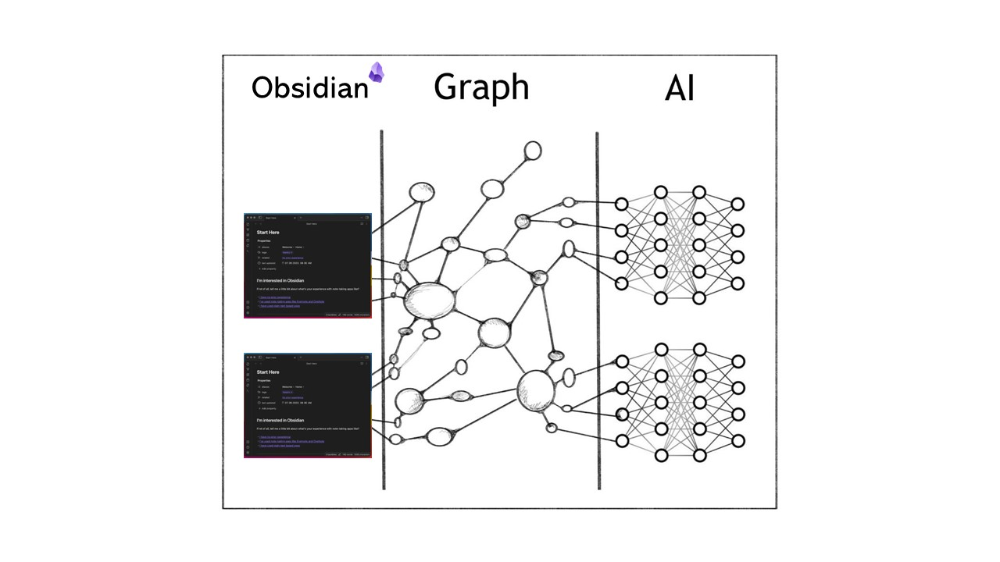

# D'un vault Obsidian vers un graphe de connaissance (_knowledge graph_)

Vous trouverez dans ce repo les quelques lignes de codes pour transformer votre vault Obsidian en un graphe de connaissance que vous pourrez utiliser dans vos applications LLMs.

